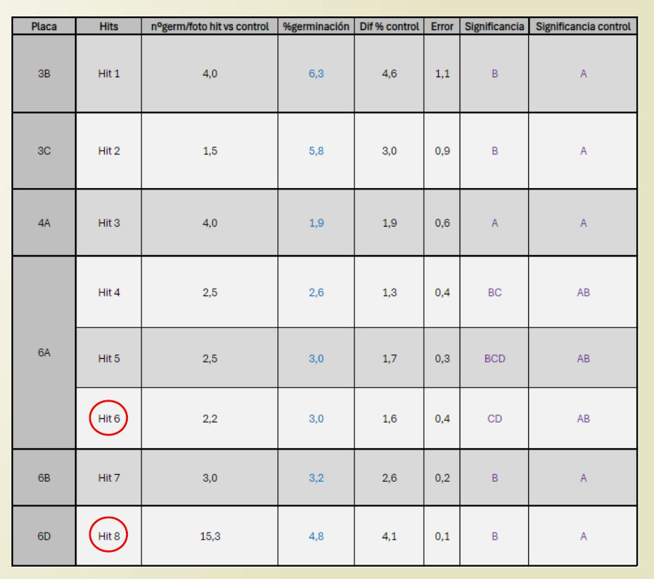

My master's thesis for the Plant Breeding master's at the Universitat
Politècnica de València (COMAV institute), supervised by Dr. Ricardo Mir Moreno.
It sits at the boundary I care about: a real biological problem tackled with a
systematic, data-driven screen.

## The problem

Rising temperatures hit plant sexual reproduction hard, and pollen is one of the
most heat-sensitive stages, which makes it a direct threat to crop yield. In
rapeseed (*Brassica napus* DH4079), a short heat shock (38 °C for two hours)
collapses pollen germination from ~61% down to below 2%. The question: can small
molecules buffer that damage?

## What I did

- **Built the assay.** Set up and optimised an in-vitro pollen-germination
  system for rapeseed, tuning the medium (CaCl₂, KNO₃, H₃BO₄, sucrose, Tris)
  and pH until the readout was robust enough to screen against.
- **Ran a high-throughput screen.** Screened an 800-compound library
  (Natural Product-Like, Otava Chemicals) for molecules that rescue germination
  in heat-stressed pollen, using an Opentrons OT-2 liquid-handling robot to keep
  the plating reproducible.
- **Measured it properly.** Quantified viability and germination with DAPI
  staining, fluorescence and confocal microscopy, and tested significance
  statistically.
- **Followed the hits into development.** Set up in-vitro microspore culture and
  mapped how floral-bud size maps to gametophytic maturation stage, to test
  candidate compounds further upstream.

## What came out

The screen returned **8 candidate hits** from the 800 compounds, a workable
shortlist for follow-up. Along the way the work pinned down the germination
medium, showed DMSO protects at mild (32 °C) but not strong (38 °C) heat, and
identified the optimal floral-bud interval (3–3.4 mm) for studying in-vitro
gametophytic development. It's an early step toward finding the genetic targets
behind pollen heat tolerance, and toward breeding crops that hold up in a
warming climate.

## Why it's here

This is where my biology comes from: hands-on wet-lab work, but framed as a
screen: assay design, high-throughput measurement, and reading signal out of
hundreds of noisy conditions. It's the same instinct I now bring to data.

If you'd like to read the full thesis, [email me](mailto:marcreciocel@gmail.com) and I'll gladly share it.
